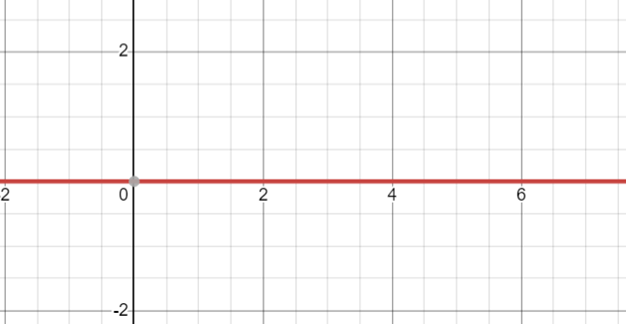
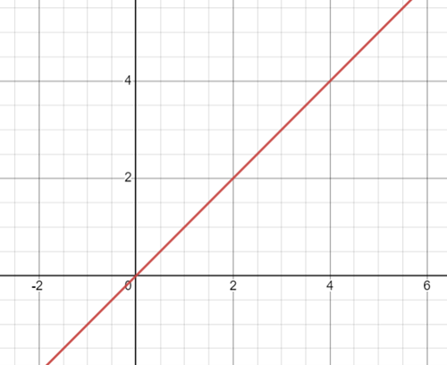
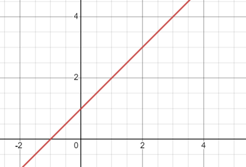
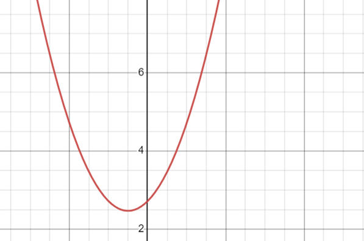
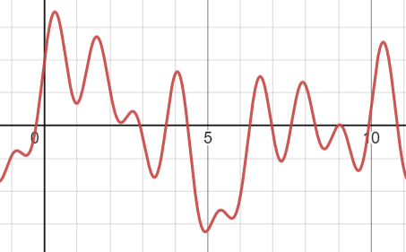

# Chapter 7
## Problem 1
### a.)
  $$ f_1{(x)}= \beta_0 + \beta_1x + \beta_2x^2 + \beta_3x^3$$

### b.)
  $$\begin{aligned}
  f_2{(x)} &= \beta_0 + \beta_1x + \beta_2x^2 + \beta_3x^3 + \beta_4(x-\xi)^3 \\
  &= \beta_0 + \beta_1x + \beta_2x^2 + \beta_3x^3 + \beta_4(x^3-3x^2\xi+3x\xi^2-\xi^3)\\
  &= (\beta_0-\beta_4\xi^3) + x(\beta_1+3\beta_4\xi^2) + x^2(\beta_2-3\beta_4\xi) + x^3(\beta_3+\beta_4)   
  \end{aligned}
  $$

### c.)
  $$\begin{aligned}
  f_1(\xi) = \beta_0+\beta_1\xi+\beta_2\xi^2+\beta_3\xi^3 \\
  \\
  f_2(\xi) &= (\beta_0-\beta_4\xi^3) + \xi(\beta_1+3\beta_4\xi^2) + \xi^2(\beta_2-3\beta_4\xi) + \xi^3(\beta_3+\beta_4) \\
  &=  \beta_0-\beta_4\xi^3+ \beta_1\xi+ 3\beta_4\xi^3 + \beta_2\xi^2-3\beta_4\xi^3+\beta_3\xi^3+\beta_4\xi^3 \\
  &= \beta_0+ \beta_1\xi+\beta_2\xi^2+\beta_3\xi^3 = f_1(\xi)
  \end{aligned}$$

### d.)
  $$\begin{aligned}
  f_1'(\xi) = \beta_1+2\beta_2\xi+3\beta_3\xi^2 \\
  \\
  f_2'(\xi) &= (\beta_1+3\beta_4\xi^2) + 2\xi(\beta_2-3\beta_4\xi) + 3\xi^2(\beta_3+\beta_4) \\
  &=  \beta_1 + 3\beta_4\xi^2 + 2\beta_2\xi - 6\beta_4\xi^2 + 3\beta_3\xi^2 + 3\beta_4\xi^2 \\
  &=  \beta_1 + 2\beta_2\xi + 3\beta_3\xi^2 = f_1'(\xi)
  \end{aligned}$$

### e.)
  $$\begin{aligned}
  f_1''(\xi) = 2\beta_2+6\beta_3\xi \\
  \\
  f_2''(\xi) &= 2(\beta_2-3\beta_4\xi) + 6\xi(\beta_3+\beta_4) \\
  &=  2\beta_2 - 6\beta_4\xi + 6\beta_3\xi + 6\beta_4\xi \\
  &=  2\beta_2 + 6\beta_3\xi^2 = f_1''(\xi)
  \end{aligned}$$
  

## Problem 2
### a.)
 \
Lambda handles over fitting and controls the wigglyness of the function. In this case g hat = 0 due to the large smoothing parameter. g_(0)(x) -> 0

### b.)
 \
g hat = cx+d where c and d are constants due to the large smoothing parameter. g_(2)(x) -> 0

### c.)
 \
g hat = cx2+dx+e where c, d, and e are constants due to the large smoothing parameter. g_(3)(x) -> 0

### d.)
 \
The smaller lambda, the more wiggly the function and g hat interpolates yi when Lambda = 0. No smoothing occurs.

### e.)
 \
The smaller lambda, the more wiggly the function and g hat interpolates yi when Lambda = 0. No smoothing occurs.

## Problem 3
```{R}
X = seq(-2,2,0.1)
Y = rep(NA,length(X))
for (i in 1:length(X)){
  if (X[i]<1){
    Y[i] = 1 + 1*X[i]
  }
  else{
    Y[i] = 1 + 1*X[i] - 2*(X[i]-1)^2
  }
}

plot(X,Y,type='l') +
abline(h=0, col = "green") + 
abline(v=0, col = "blue") +
abline(v = 1, col = "red")
```
As long s x<1 the line is linear with a slope of 1. For 1<x the line is quadratic. 

## Problem 6
### a.)
```{R results='show',warning=FALSE}
library(ISLR)
library(boot)
```

```{R results='show',warning=FALSE}
set.seed(0)
cv.error.10 = rep(0,10)
for (i in 1:10) {
  glm.fit=glm(wage~poly(age,i),data=Wage)
  cv.error.10[i]=cv.glm(Wage,glm.fit,K=10)$delta[1]
}

cv.error.10
plot(cv.error.10, type="b", xlab="degree", ylab="error")

lm.fit = glm(wage~poly(age,4),data=Wage)
summary(lm.fit)
```
From the Cross validation performance we can see that the performance does not improve much when the degree is increased from 4. 

```{R}
fit.1 = lm(wage~age ,data=Wage)
fit.2 = lm(wage~poly(age ,2) ,data=Wage)
fit.3 = lm(wage~poly(age ,3) ,data=Wage)
fit.4 = lm(wage~poly(age ,4) ,data=Wage)
fit.5 = lm(wage~poly(age ,5) ,data=Wage)
anova(fit.1,fit.2,fit.3,fit.4,fit.5)
```
The comparison of model 1 and 2 to the model 4 shows p-values of statistical significance below 0.05. Models 3 almost has a p-values of statistical significance when comapred to model 4. Model 5 has a high p-value when compared to model 4 that is not statistically significant. This indicates that a cubic or quadratic model has the best fit to the data. These results are the same as waht was gained through polynomial regression. 

```{R}
agelims=range(Wage$age)
age.grid=seq(from=agelims[1],to=agelims[2])

preds=predict(lm.fit,newdata=list(age=age.grid),se=TRUE)
se.bands=cbind(preds$fit+2*preds$se.fit,preds$fit-2*preds$se.fit)

plot(Wage$age,Wage$wage,xlim=agelims,cex=.5,col="darkgrey")
title("Polynomial fit using degree 4")
lines(age.grid,preds$fit,lwd=2,col="blue")
matlines(age.grid,se.bands,lwd =1,col="blue",lty =3)
```

### b.)
```{R}
set.seed(0)
cv.error.20 = rep(NA,19)
for (i in 2:20) {
  Wage$age.cut = cut(Wage$age,i)
  step.fit=glm(wage~age.cut,data=Wage)
  cv.error.20[i-1]=cv.glm(Wage,step.fit,K=10)$delta[1]
}

cv.error.20
plot(cv.error.20,type='b',ylab="error",xlab='cuts')
```
From the data we can see that after 7 cuts in the step function that we see little improvement in performance.

```{R}
step.fit = glm(wage~cut(age,7), data=Wage)
preds2=predict(step.fit,newdata=list(age=age.grid), se=T)
se.bands2=cbind(preds2$fit+2*preds2$se.fit,preds2$fit-2*preds2$se.fit)
plot(Wage$age,Wage$wage,xlim=agelims,cex=.5,col="darkgrey")
title("Step function using 7 cuts")
lines(age.grid,preds2$fit,lwd=2,col="blue")
matlines(age.grid,se.bands2,lwd =1,col="blue",lty =3)
```
## Problem 10
### a.)
```{R}
library(caTools)

set.seed(0)
college_data = College
college_sample = sample.split(college_data$Outstate, SplitRatio = 0.80)
college_train = subset(college_data, college_sample==TRUE)
college_test = subset(college_data, college_sample==FALSE)
```


```{r results='show',warning=FALSE}
library(leaps)

fit.fwd = regsubsets(Outstate~., data=college_train, nvmax=17, method="forward")
fit.summary = summary(fit.fwd)

which.min(fit.summary$cp)
which.min(fit.summary$bic)
which.max(fit.summary$adjr2)
par(mfrow=c(2,2))
plot(1:17, fit.summary$cp,xlab="Variables",ylab="Cp",main="Cp", type='b')
plot(1:17, fit.summary$bic,xlab="Variables",ylab="BIC",main="BIC", type='b')
plot(1:17, fit.summary$adjr2,xlab="Variables",ylab="Adjusted R2",main="Adjusted R2", type='b')

coef(fit.fwd,6)
```
From the Cp, BIC, and Adjusted R squared we see that they are all in agreement that after 6 variables are included the model does not improve dramatically. Therefore 6 variables is ideal as it is lower complexity with a high relative performance. 

### b.)
```{R}
library(gam)

gam.m1 = gam(Outstate~Private+
               s(Room.Board,4)+
               s(PhD,4)+
               s(perc.alumni,2)+
               s(Expend,4)+
               s(Grad.Rate,5), data=college_train)
par(mfrow=c(2,3))
plot(gam.m1, col="blue", se=T)
```
When all other variables are kept constant the state tuition seems to increase as room costs or the proportion of donating alumni increases.

### c.)
```{R}
preds = predict(gam.m1,newdata = college_test)
mse = mean((college_test$Outstate - preds)^2)
print(mse)
```
The graduation rate seems to have a non-linear relationship with the outstate variable.

### d.)
```{R}
gam.m2 = gam(Outstate~Private+s(Room.Board,4)+s(PhD,4)+s(perc.alumni,2)+s(Expend,4), data=college_train)
gam.m3 = gam(Outstate~Private+s(Room.Board,4)+s(PhD,4)+s(perc.alumni,2)+s(Expend,4)+Grad.Rate, data=college_train)
gam.m4 = gam(Outstate~Private+s(Room.Board,4)+s(PhD,4)+s(perc.alumni,2)+s(Expend,4)+s(Grad.Rate,4), data=college_train)
anova(gam.m2,gam.m3,gam.m4,gam.m1, test="F")
```
 From the Anova we can see that a Generalized Additive Model with a non-linear spline of degree 4 that also includes the Grad.rate variable is required to produce the response.
