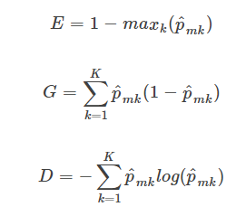

# Question 3

```{R}
# plot Gini Index, Classification Error and Cross-Entropy
p <- seq(0, 1, 0.01)
gini.index <- 2 * p * (1 - p)
class.error <- 1 - pmax(p, 1 - p)
cross.entropy <- - (p * log(p) + (1 - p) * log(1 - p))
df = data.frame(cbind(p, gini.index, class.error, cross.entropy))
{plot(1, type="n", main="Gini Index, Classification Error and Cross-Entropy",
     xlab=expression(hat(p)[m1]), ylab="Values", xlim=seq(0,1), ylim=c(0, 1))
lines(df$p,df$cross.entropy,col="blue",lwd=2)
lines(df$p,df$class.error,col="red",lwd=2)
lines(df$p,df$gini.index,col="green",lwd=2)
legend("bottom",
       legend=c("Gini Index", "Classification Error", "Cross-Entropy"),
       col=c("green", "red", "blue"),
       lty=c(1,1,1), 
       lwd=c(2,2,2))}
```

# Question 8
## a.)
```{R}
# import data
library(ISLR)
library(caTools)
df_data = Carseats

# split data into training and testing sets
set.seed(0)
train_test_filter = sample.split(df_data$Sales, SplitRatio = 0.75)
df_train = subset(df_data, train_test_filter==TRUE)
df_test = subset(df_data, train_test_filter==FALSE)
```

## b.)
```{R fig.height=8, fig.width=15}
# import tree library 
library(tree)

# create regression tree model 
reg_tree_model = tree(Sales~.,data=df_train)
summary(reg_tree_model)

# plot tree
{plot(reg_tree_model)
text(reg_tree_model,pretty=0)}

# calculate test MSE
yhat= predict(reg_tree_model ,newdata=df_test)
mse = mean((yhat-df_test$Sales)^2)

print(paste("The test MSE is: ", mse))
```

## c.)
```{R fig.height=5, fig.width=10}
# apply cross validation on tree complexity
set.seed(0)
cv_reg_tree_model = cv.tree(reg_tree_model)
plot(cv_reg_tree_model$size ,cv_reg_tree_model$dev ,type="b")

# prune tree to best size from CV
set.seed(0)
prune_reg_tree_model=prune.tree(reg_tree_model ,best=5)
plot(prune_reg_tree_model )
text(prune_reg_tree_model ,pretty =0)

# calculate test MSE on pruned tree
yhat= predict(prune_reg_tree_model ,newdata=df_test)
mse = mean((yhat-df_test$Sales)^2)

print(paste("The test MSE after pruning is: ", mse))
```
Pruning the decision tree only slightly improves the MSE.

## d.)
```{R}
# import random forest package
library(randomForest)

# create bagging model
set.seed(0)
bag_tree_model = randomForest(Sales~.,
                         data=df_train,
                         mtry=ncol(df_train)-1,
                         importance =TRUE)

# calculate test MSE on pruned tree
yhat = predict(bag_tree_model ,newdata=df_test)
mse = mean((yhat-df_test$Sales)^2)

print(paste("The test MSE for the bagging model is: ", mse))

importance(bag_tree_model)
```
The bagging approach substantially decreases the MSE. The most important predictors are `ShelveLoc` and `Price`.


## e.)
```{R}
# create random forest model
set.seed(0)
rf_tree_model = randomForest(Sales~.,
                         data=df_train,
                         importance =TRUE)

# calculate test MSE on pruned tree
yhat = predict(rf_tree_model ,newdata=df_test)
mse = mean((yhat-df_test$Sales)^2)

print(paste("The test MSE for the RF model is: ", mse))

importance(rf_tree_model)
```
The MSE is reduced substantially for the random forest model. The most important predictors are `ShelveLoc` and `Price`.
By reducing `m` the size increases the error rate slightly. 

# Question 9
## a.)
```{R}
# import data
set.seed(0)
df_data = OJ

# split data
train_test_filter = sample.split(df_data$Purchase, 
                                 SplitRatio = 800/nrow(df_data))
df_train = subset(df_data, train_test_filter==TRUE)
df_test = subset(df_data, train_test_filter==FALSE)
```

## b.)
```{R}
# create tree classifier model
set.seed(0)
class_tree_model = tree(Purchase~.,data=df_train)
summary(class_tree_model)
```
 The training error rate of the model is: 0.1575
 The number of terminal nodes on the tree is 9
 
## c.)
```{R}
class_tree_model
```
4) LoyalCH < 0.0356415 53    0.00 MM ( 0.00000 1.00000 ) * is a terminal node. 
This shows us that whenever predictor `LoyalCH` is smaller than `0.0356415` that the classification of Purchase is equal to `MM`, otherwise then it means that the next nested node should be considered. 

## d.)
```{R fig.height=7, fig.width=10}
{plot(class_tree_model)
text(class_tree_model,pretty=0)}
```
From this tree we can see how nested the predictors are in describing the classifications. 

## e.)
```{R}
# predict test data 
pred_class_tree_model = predict(class_tree_model, 
                                newdata = df_test, 
                                type = "class")

# produce confusion matrix
conf_mat = table(pred_class_tree_model,df_test$Purchase)
conf_mat

# calculate error rate
test_error_rate = sum(conf_mat[1,2], conf_mat[2,1])/sum(conf_mat)
print(paste("The test error rate is: ", test_error_rate))
```

## f.)
```{R}
# cross validation on tree model complexity
set.seed(0)
cv_class_tree_model = cv.tree(class_tree_model, FUN=prune.misclass)
cv_class_tree_model
```

## g.)
```{R}
# plot deviance against tree size
plot(cv_class_tree_model$size ,cv_class_tree_model$dev ,type="b")
```
It seems that the ideal tree size might be 2.

## h.)
Even though a size of 8 (153) gives the lowest cross-validated classification error rate, it is not too much different from that given by a size of 2 (157). Therefore 2 might be the better option when considering Occam's razor. 

## i.)
```{R}
# prune tree
prune_class_tree_model <- prune.misclass(class_tree_model, best = 2)
plot(prune_class_tree_model)
text(prune_class_tree_model, pretty = 0)
```

## j.)
```{R}
# compare pruned tree to original unpruned tree
summary(class_tree_model)
summary(prune_class_tree_model)
```
The unpruned tree has a slightly lower training error rate. However, the pruned tree is much less complex. 


## k.)
```{R}
# predict test data 
pred_class_tree_model = predict(prune_class_tree_model, 
                                newdata = df_test, 
                                type = "class")

# produce confusion matrix
conf_mat = table(pred_class_tree_model,df_test$Purchase)
conf_mat

# calculate error rate
test_error_rate = sum(conf_mat[1,2], conf_mat[2,1])/sum(conf_mat)
print(paste("The test error rate is: ", test_error_rate))
```
The testing error rate is also slightly higher for the pruned tree. 

# Question 10
## a.)
```{R}
# remove NA for salaries
df_data = Hitters
df_data = df_data[-which(is.na(df_data$Salary)), ]
sum(is.na(df_data$Salary))

# log transform salary data
df_data$Salary = log(df_data$Salary)
```

## b.)
```{R}
# split data
df_train = df_data[1:200, ]
df_test = df_data[-(1:200), ]
```

## c.)
```{R}
# import libraries
library(gbm)

# boosting
set.seed(0)
lambdas = 10^seq(-5, -1, by = 0.05)
train_mse = rep(NA, length(lambdas))
test_mse = rep(NA, length(lambdas))
for (i in 1:length(lambdas)) {
    boost= gbm(Salary ~ ., data = df_train, distribution = "gaussian", 
        n.trees = 1000, shrinkage = lambdas[i])
    train_pred = predict(boost, df_train, n.trees = 1000)
    test_pred = predict(boost, df_test, n.trees = 1000)
    train_mse[i] = mean((df_train$Salary - train_pred)^2)
    test_mse[i] = mean((df_test$Salary - test_pred)^2)
}

# plot results
plot(lambdas, 
     train_mse, 
     type = "b", 
     main = 'Training Set MSE vs Shrinkage', 
     xlab = "Shrinkage", 
     ylab = "Training Set MSE")
```

## d.)
```{R}
# plot MSe vs Shrinkage
plot(lambdas, 
     test_mse, 
     type = "b", 
     main = 'Test Set MSE vs Shrinkage', 
     xlab = "Shrinkage", 
     ylab = "Test Set MSE")

min(test_mse)

lambdas[which.min(test_mse)]
```

## e.)
```{R}
# import library
library(glmnet)

# Regression model
set.seed(0)
lm = lm(Salary ~ ., data = df_train)
lm_pred = predict(lm, df_test)
mean((df_test$Salary - lm_pred)^2)

x_train = model.matrix(Salary ~ ., data = df_train)
x_test = model.matrix(Salary ~ ., data = df_test)
lasso = glmnet(x_train, df_train$Salary, alpha = 1)
lasso_pred = predict(lasso, s = 0.01, newx = x_test)
mean((df_test$Salary - lasso_pred)^2)
```
The test MSE of boosting model is lower than linear and Lasso models.

## f.)
```{R}
set.seed(0)
best = gbm(Salary ~ ., data = df_train, distribution = "gaussian", 
    n.trees = 1000, shrinkage = lambdas[which.min(test_mse)])

summary(best)
```
CAtBat, CRuns and PutOuts are most important predictors in
the boosted model

## g.)
```{R}
set.seed(0)
rf = randomForest(Salary ~ ., data = df_train, ntree = 500, mtry = 19)
rf_pred = predict(rf, df_test)
mean((df_test$Salary - rf_pred)^2)
```
The test MSE of bagging is lower than boosting.